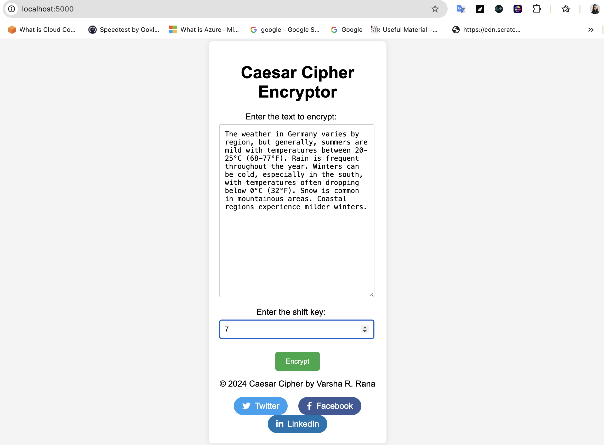
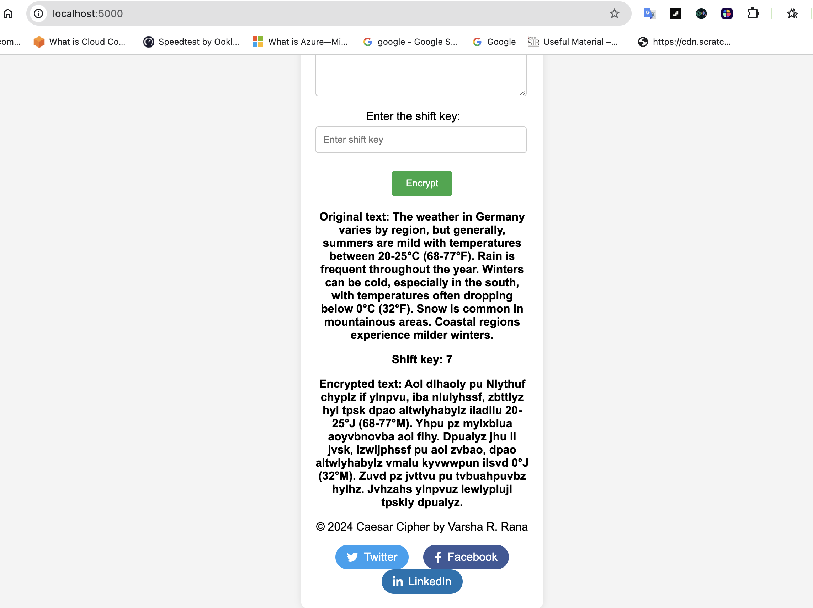

```markdown
# Caesar Cipher Web Application

This project is a simple web application that implements a Caesar Cipher encryption algorithm using Python and Flask. The web interface allows users to input text and a shift key, and it provides the encrypted text based on the Caesar Cipher method.

## Features

- **Encrypt text**: Users can input text and a shift key to get the encrypted result.
- **Support for uppercase and lowercase letters**: The cipher handles both cases.
- **Preserves special characters**: Punctuation and spaces remain unchanged.

## Technology Stack

- **Python**: The backend logic is implemented in Python.
- **Flask**: A lightweight web framework for Python that serves the web pages and handles form submissions.
- **HTML/CSS**: For creating the user interface.

## Getting Started

### Prerequisites

Make sure you have Python installed on your machine. You can download Python from [python.org](https://www.python.org/downloads/).

### Installation

1. **Clone the repository:**

   ```bash
   git clone https://github.com/Vrana710/caesar-cipher-web-app.git
   cd caesar-cipher-web-app
   ```

2. **Create a virtual environment (optional but recommended):**

   ```bash
   python -m venv venv
   ```

3. **Activate the virtual environment:**

   - **On Windows:**

     ```bash
     venv\Scripts\activate
     ```

   - **On macOS/Linux:**

     ```bash
     source venv/bin/activate
     ```

4. **Install the required dependencies:**

   ```bash
   pip3 install flask
   ```

### Running the Application

1. **Start the Flask application:**

   ```bash
   python3 app.py
   ```

2. **Open a web browser and navigate to:**

   ```
   http://127.0.0.1:5000/
   ```

   You should see the Caesar Cipher web application interface.

## Preview





## Usage

1. **Enter the text** you want to encrypt in the "Enter the text to encrypt" input field.
2. **Enter the shift key** (an integer value) in the "Enter the shift key" input field.
3. **Click the "Encrypt" button** to see the encrypted text displayed on the page.

## Folder Structure

- `app.py`: The main Python script that contains the Flask application logic.
- `templates/`: Contains HTML templates.
  - `index.html`: The main HTML file for the web interface.
- `static/`: Contains static files such as CSS.
  - `styles.css`: The CSS file for styling the web page.

## Contributing

If you would like to contribute to this project, please fork the repository and submit a pull request with your changes. Ensure that you follow best practices and include appropriate tests.

## License

This project is licensed under the MIT License - see the [LICENSE](LICENSE) file for details.

## Acknowledgements

- [Flask](https://flask.palletsprojects.com/) for the web framework.
- [Python](https://www.python.org/) for the programming language.

```

### Key Sections Explained:

- **Project Title and Description**: Gives an overview of what the project is about.
- **Features**: Lists the key features of the application.
- **Technology Stack**: Describes the technologies used.
- **Getting Started**: Instructions for setting up and running the project.
- **Usage**: Provides a guide on how to use the web application.
- **Folder Structure**: Describes the organization of files and folders.
- **Contributing**: Guidelines for contributing to the project.
- **License**: Licensing information.

Replace `https://github.com/Vrana710/caesar-cipher-web-app.git` with the actual URL of your GitHub repository, and adjust other project-specific details as needed.